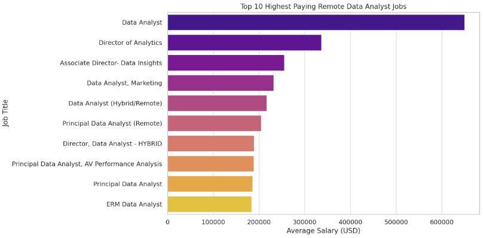

# 📊 Data Analyst SQL Portfolio Project

## 🚀 Introduction

Welcome to my **SQL Portfolio Project**, an analytical deep-dive into the evolving data job market — with a keen lens on **data analyst** roles. This initiative is a personal exploration to uncover which roles offer the most lucrative compensation, what skills are in highest demand, and how the two intersect to inform strategic career development.

🧠 Check out my SQL queries here: [SQL_course_Project](/SQL_course_Project/)

---

## 🧩 Background

The inception of this project was rooted in a personal objective: to **decode the dynamics** of the data analyst job market and tailor my skill-building roadmap accordingly. I sought to understand:

- 💼 Which job roles command the highest compensation?
- 🛠 What are the most in-demand skills?
- 🧠 Which capabilities bridge the gap between **high salary** and **high market demand**?

🔍 The dataset powering this analysis is sourced from **Luke Barousse’s SQL course** ([https://www.lukebarousse.com/]), which offers comprehensive job posting data — spanning titles, salaries, geographic locations, and required technical competencies.

### Key Questions Explored:
1. 💰 What are the top-paying data analyst roles?
2. 🧩 What skills are required for these top-tier jobs?
3. 📈 Which skills are in the highest demand?
4. 🎓 Which skills correlate with elevated salaries?
5. 🎯 What are the most strategic skills to develop for maximum market impact?

---

## 🧰 Tools & Technologies

This project leverages a suite of modern tools for data exploration and query development:

- **🗃 SQL** – The primary querying language used to extract and manipulate relational data.
- **🐘 PostgreSQL** – A robust open-source database system for managing and executing SQL queries.
- **🖥 Visual Studio Code** – My development environment of choice for coding, database integration, and query execution.

---

## 🔍 Analysis Approach

Each SQL query in this project was designed to surgically examine a specific facet of the data analyst job landscape. Below is a breakdown of the analytical process:


### 💸 1. Top-Paying Data Analyst Roles
By filtering remote job listings and sorting by salary, I isolated the most financially rewarding opportunities for data analysts.

```sql
SELECT
    job_id,
    job_title,
    job_location,
    job_schedule_type,
    salary_year_avg,
    job_posted_date
FROM
    job_postings_fact
WHERE
    job_title = 'Data Analyst'
    AND salary_year_avg IS NOT NULL
    AND job_location = 'Anywhere'
ORDER BY
    salary_year_avg DESC
LIMIT 10;
```



### 🛠 2. Skills Required for Top-Paying Jobs
By joining job and skill datasets, I identified which technical competencies are consistently associated with high-paying roles.

```sql 
-- Gets the top 10 paying Data Analyst jobs
WITH top_paying_jobs AS (
    SELECT
        job_id,
        job_title,
        salary_year_avg
    FROM
        job_postings_fact
    WHERE
        job_title_short = 'Data Analyst'
        AND salary_year_avg IS NOT NULL
        AND job_location = 'Anywhere'
    ORDER BY
        salary_year_avg DESC
    LIMIT 10
)
SELECT
    top_paying_jobs.job_id,
    top_paying_jobs.job_title,
    top_paying_jobs.salary_year_avg,
    skills_dim.skills
FROM
    top_paying_jobs
    INNER JOIN
    skills_job_dim ON top_paying_jobs.job_id = skills_job_dim.job_id
    INNER JOIN
    skills_dim ON skills_job_dim.skill_id = skills_dim.skill_id
ORDER BY
    top_paying_jobs.salary_year_avg DESC;
```


### 📊 3. Most In-Demand Skills
This query quantifies skill frequency across postings to reveal what the market values most for data analyst roles.

```sql 
SELECT
  skills_dim.skills,
  COUNT(skills_job_dim.job_id) AS demand_count
FROM
  job_postings_fact
  INNER JOIN
    skills_job_dim ON job_postings_fact.job_id = skills_job_dim.job_id
  INNER JOIN
    skills_dim ON skills_job_dim.skill_id = skills_dim.skill_id
WHERE
  job_postings_fact.job_title_short = 'Data Analyst'
GROUP BY
  skills_dim.skills
ORDER BY
  demand_count DESC
LIMIT 5;
```
---
| 💡 Skill     | 📈 Demand Count |
|--------------|----------------|
| SQL          | 7,291          |
| Excel        | 4,611          |
| Python       | 4,330          |
| Tableau      | 3,745          |
| Power BI     | 2,609          |

---

### 🔍 Key Insights

- **SQL is universally important**  
  It’s the most demanded skill and also dominates in high-paying jobs. Knowing SQL is essential.

- **Python ranks high in both**  
  Strong programming skills make candidates more competitive across all levels.

- **Excel is in high demand, but not in top-paying jobs**  
  It suggests Excel is more important for entry/mid roles, while advanced tools are needed at senior levels.

- **Niche cloud/data tools (Databricks, Snowflake, Azure)**  
  These are more common in high-paying jobs — likely because they indicate experience with big data systems and modern analytics stacks.

- **Visualization skills (Tableau, Power BI)**  
  Both are important across job tiers, but higher-paying roles might emphasize strategic over operational use.


### 💼 4. Skills with the Highest Salary Potential
This analysis uncovers which individual skills are most closely tied to elevated compensation levels.

```sql 
SELECT
  skills_dim.skills AS skill,
  ROUND(AVG(job_postings_fact.salary_year_avg),2) AS avg_salary
FROM
  job_postings_fact
INNER JOIN
  skills_job_dim ON job_postings_fact.job_id = skills_job_dim.job_id
INNER JOIN
  skills_dim ON skills_job_dim.skill_id = skills_dim.skill_id
WHERE
  job_postings_fact.job_title_short = 'Data Analyst'
  AND job_postings_fact.salary_year_avg IS NOT NULL
GROUP BY
  skills_dim.skills
ORDER BY
  avg_salary DESC;
```

### 🧠 5. Strategic Skills: High Salary + High Demand
By blending salary and demand metrics, this final query surfaces the skills offering the best of both worlds — strong compensation and employer demand.

```sql 
SELECT
  skills_job_dim.skill_id,
  skills_dim.skills, 
  COUNT(skills_job_dim.job_id) as demand_count,
  ROUND(AVG(job_postings_fact.salary_year_avg),0) AS avg_salary
FROM
  job_postings_fact
  INNER JOIN
    skills_job_dim ON job_postings_fact.job_id = skills_job_dim.job_id
  INNER JOIN
    skills_dim ON skills_job_dim.skill_id = skills_dim.skill_id
WHERE
  job_postings_fact.job_title_short = 'Data Analyst'
	AND job_postings_fact.salary_year_avg IS NOT NULL
  AND job_postings_fact.job_work_from_home = True
GROUP BY
  skills_job_dim.skill_id,
  skills_dim.skills
HAVING
	COUNT(skills_job_dim.job_id) > 10
ORDER BY
	avg_salary DESC,
	demand_count DESC
LIMIT 10;
```
---
| 💼 Skill        | 📈 Demand Count | 💰 Avg. Salary (USD) |
|-----------------|------------------|----------------------|
| Go              | 27               | 115,320              |
| Confluence      | 11               | 114,210              |
| Hadoop          | 22               | 113,193              |
| Snowflake       | 37               | 112,948              |
| Azure           | 34               | 111,225              |
| BigQuery        | 13               | 109,654              |
| AWS             | 32               | 108,317              |
| Java            | 17               | 106,906              |
| SSIS            | 12               | 106,683              |
| Jira            | 20               | 104,918              |

---


Each query not only served to answer a specific question but also to improve my understanding of SQL and database analysis. Through this project, I learned to leverage SQL's powerful data manipulation capabilities to derive meaningful insights from complex datasets.

### 📚 What I Learned
This project significantly expanded my SQL capabilities and analytical thinking. Key takeaways include:

- **🧩 Advanced Query Design:** Crafting modular queries using CTEs (WITH clauses) and multi-table joins.
- **📉 Data Aggregation & Transformation:** Mastering grouping functions such as COUNT(), AVG(), and GROUP BY to reveal insights.
- **🧠 Real-World Problem Solving:** Translating ambiguous questions into structured, SQL-driven analytical solutions.


### 💡 Key Insights

- **💵 High-Paying Roles:**  Some remote data analyst jobs exceed $650,000/year, signaling lucrative potential in the field.
- **🧠 Critical Skills:** SQL consistently appears across high-paying and high-demand roles, making it indispensable.
- **🔥 Market Demand:** Core skills like SQL, Excel, and Python are repeatedly requested, suggesting they’re foundational.
- **🎯 Specialization Pays Off:** Niche tools (e.g., Solidity, Go) tend to align with higher salaries, emphasizing the value of technical depth.
- **🛠 Strategic Learning** Skills that balance high demand and strong compensation are prime targets for ongoing development.

### 🧾Conclusion

This project was more than just an academic exercise — it was a strategic exploration of the modern data job market. By pairing SQL prowess with real-world data, I uncovered actionable insights that will inform my professional development path. For aspiring data analysts, the message is clear:

💡 Invest in mastering core tools like SQL, stay informed on market trends, and continuously evolve your skillset to remain competitive.